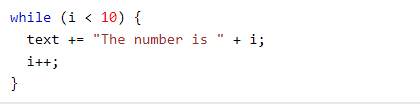

# Read05 
## What's Javascript Operators
An operator produces a result by performing some action on a single or multiple operands (data value). For example, 1 + 2 is an operator with 1 as the left operand and 2 as the right operand. The + operator adds two numeric numbers, yielding a result of 3, in this case.
## JavaScript categories of operators
1. Logical Operators
2. Arithmetic Operators
3. Conditional Operators
4. Assignment Operators
5. Comparison Operators

## Examples 
Logical Operators : &&

Arithmetic Operators : 1+1

Conditional Operators : var a = 10, b = 5;

Assignment Operators : *=

Comparison Operators : ===

### loops in Javascript
Loops come in a variety of shapes and sizes, but they all perform the same thing: they repeat an activity a certain number of times. Loops come in a variety of shapes and sizes, but they all perform the same thing: they repeat an activity a certain number of times.

Example (for loop)

Example (while loop)

### All kinds of loops in Javascript
* while  
* do/while 
* for 
* for/in 
* for/of 
---
### Links
**To know more about loops** [Check this link](https://developer.mozilla.org/en-US/docs/Web/JavaScript/Guide/Loops_and_iteration)

**To know more about Operators** [Check this link](https://developer.mozilla.org/en-US/docs/Web/JavaScript/Guide/Loops_and_iteration)

