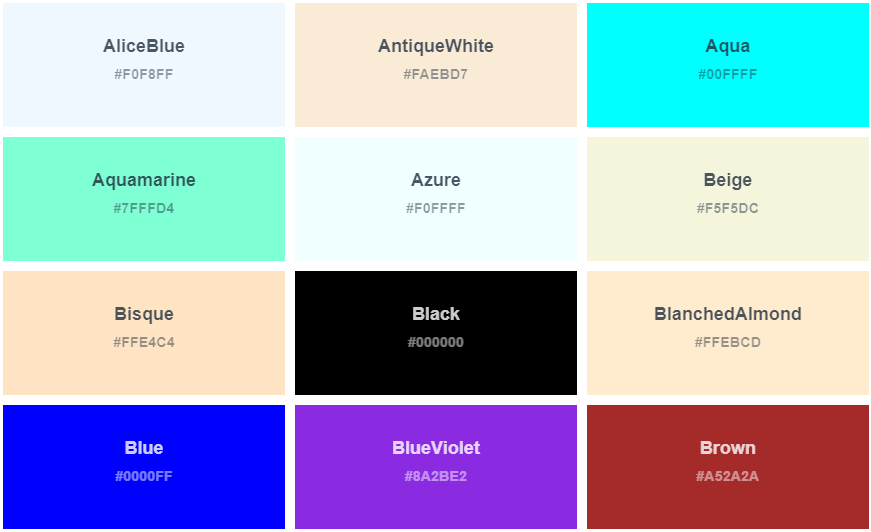
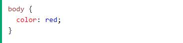

# CSS (Cascading Style Sheets) 

## What's CSS 
* Cascading Style Sheets (CSS) is a style sheet language for describing the presentation of a document written in a markup language like HTML or CSS. It is also one of the World Wide Web's cornerstone technologies.

## Types to add CSS (Cascading Style Sheet)
1. Inline CSS: Inline CSS is a type of CSS that includes the CSS property in the body section of an element. The style attribute is used to specify this type of style within an HTML tag.
2. Internal or Embedded CSS: This is useful when a single HTML document needs to be formatted differently. The CSS rule set should be in the head section of the HTML file, i.e. the CSS should be embedded in the HTML file.

3. External CSS: External CSS is a distinct CSS file that simply contains stylistic properties via tag attributes (for example, class, id, header, and so on). CSS properties should be stored in a separate file with the.css extension and connected to the HTML document via the link tag. This means that only one style can be applied to each element, and it will be applied across all web pages.

### CSS colors
There are 140 colors supported by the web browsers.

Example 

**To Know more about all the colors that supported =**
[**(check this link)**]
(https://www.w3schools.com/cssref/css_colors.asp)

