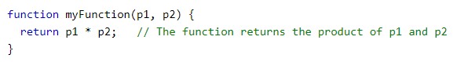
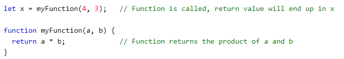

# Functions  

##  What is function 
A JavaScript function is a block of code that is used to do a certain activity. It is called when "something" invokes it (calls it).

Example 

##  Return from a function
*The function will cease execution when JavaScript reaches a return statement. If the function was invoked from a statement, JavaScript will "return" to execute the code following the invoking statement, and the return value will be "returned" to the "caller."
all web pages.

Example 

The result in x = 12 

## Operators
1. Assignment operators
2. Comparison operators
3. Arithmetic operators
4. Bitwise operators
5. Logical operators
6. String operators
7. Conditional (ternary) operator
8. Comma operator
9. Unary operators
10. Relational operators

**To Know more about Operators =**
[**(check this link)**]
(https://developer.mozilla.org/en-US/docs/Web/JavaScript/Guide/Expressions_and_Operators)

**To Know more about Functions =**
[**(check this link)**]
(https://developer.mozilla.org/en-US/docs/Web/JavaScript/Guide/Functions)

